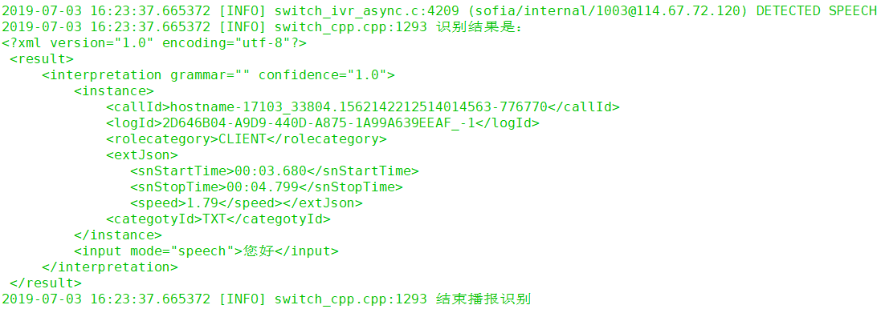

# freeswitch-ivr-lua-mrcp-sample

>FreeSWITCH IVR环境的搭建

## 测试环境

CentOS7.6 1核4G40G

## 一、安装FreeSWITCH

### 安装与启动

- FreeSWITCH官网CentOS7安装方法：
<https://freeswitch.org/confluence/display/FREESWITCH/CentOS+7+and+RHEL+7>

```bash
yum install -y http://files.freeswitch.org/freeswitch-release-1-6.noarch.rpm epel-release
yum install -y freeswitch-config-vanilla freeswitch-lang-* freeswitch-sounds-*
```

- 安装需要的模块

```bash
yum install -y freeswitch-lua freeswitch-asrtts-unimrcp
yum install -y lua-socket
```

- 启动FreeSWITCH

```bash
freeswitch -nonat -nc
```

- 进入FreeSWITCH控制台

```bash
fs_cli
```

### 配置

- 建立软连接

```bash
mkdir -p /usr/local/freeswitch/storage
ln -s /etc/freeswitch/ /usr/local/freeswitch/conf
ln -s /var/log/freeswitch/ /usr/local/freeswitch/log
ln -s /usr/share/freeswitch/scripts/ /usr/local/freeswitch/scripts
```

- 修改FreeSWITCH基本配置

编辑`/usr/local/freeswitch/conf/vars.xml`，`default_password`改为默认值1234以外的值

如果是公网环境，`internal_sip_port`和`internal_tls_port`改成5060/5061以外的可用端口，避免受到攻击

如果是公网环境，修改`/usr/local/freeswitch/conf/sip_profiles/internal.xml`的配置，`ext-rtp-ip`和`ext-sip-ip`配置为服务器公网IP

- 修改FreeSWITCH启动加载模块配置

编辑`/usr/local/freeswitch/conf/autoload_configs/modules.conf.xml`

取消 `<load module="mod_lua"/>`的注释

添加`<load module="mod_unimrcp"/>`

- 修改Lua模块配置

编辑`/usr/local/freeswitch/conf/autoload_configs/lua.conf.xml`

修改或添加

`<param name="module-directory" value="/usr/lib64/lua/5.1/?.so"/>`

`<param name="script-directory" value="/usr/share/lua/5.1/?.lua"/>`

`<param name="script-directory" value="$${script_dir}/?.lua"/>`

- 重启FreeSWITCH

Shell执行`freeswitch -stop`或在FreeSWITCH控制台执行`shutdown`，再启动

## 二、实现呼叫

### 注册分机

- 安装软电话

选择安装Adore SIP Client(iOS)、CSipSimple(Android)、MicroSIP(Windows)

最好使用手机，避免收音问题

- 注册分机

在软电话中配置账号。

服务器，FreeSWITCH的IP:之前配置的端口

账号，1001-1020中任意一个

密码，填写之前配置的密码

- 查看注册状态

软电话注册成功会有提示

同时在FreeSWITCH控制台中，执行`sofia status profile internal reg`，若能看到相关信息表明注册成功

### 使用echo测试分机

在FreeSWITCH控制台中，执行`originate user/1001 &echo`，其中1001是注册的分机号

执行成功注册的软电话会振铃，接通后可以听到自己说话的声音

## 三、配置简单的Lua流程

### 拨号计划(dialplan)

- 新建dialplan

编辑`/usr/local/freeswitch/conf/dialplan/default.xml`，在content元素中添加一个新的extension

```xml
<extension name="stage1-prompt">
    <condition field="destination_number" expression="^1101$">
        <action application="lua" data="stage1-prompt.lua"/>
    </condition>
</extension>
```

新增的配置指定`1101`分机调用`Lua`模块，执行`stage1-prompt.lua`脚本

- 加载dialplan

保存后在FreeSWITCH控制台中，执行`reloadxml`使之生效

### Lua脚本

- 创建脚本

在`/usr/local/freeswitch/scripts/`目录下新建`stage1-prompt.lua`脚本，内容如下：

```lua
-- 接通
session:answer()

-- 控制台打印日志
session:consoleLog("INFO", "开始播放音频")

-- 播放音频 “欢迎你来到新世界”
session:streamFile("/usr/local/freeswitch/storage/stage1-test.wav")

session:consoleLog("INFO", "结束播放音频")

-- 挂机
session:hangup()
```

`stage1-test.wav`是存在于本地的文件

- 测试脚本

使用软电话直接拨打1101，如果听到播报“欢迎你来到新世界”然后自动挂机，则表明流程配置成功，在控制台应该同时可以看到两行由脚本插入的INFO级别日志

- 脚本API

FreeSWITCH Lua流程的更多写法可以参考：[官方Lua API](https://freeswitch.org/confluence/display/FREESWITCH/Lua+API+Reference)

## 四、调用百度云MRCP语音识别服务

百度智能云提供了MRCP接口的语音识别服务，与FreeSWITCH对接可以实现实时语音识别，基于此可以实现复杂的智能语音交互流程

### 获取认证信息

百度云的语音服务，接入方法可以按照 [官网指引](<https://ai.baidu.com/docs#/Begin/top>) 完成，其中创建应用时需要勾选`智能呼叫中心-实时语音识别`

完成后取得API Key和Secret Key待用

### 部署百度云MRCP Server

百度MRCP Server的安装可以参考[官方文档](https://ai.baidu.com/docs#/BICC-ITMA-MrcpServer/top)

- 下载

通过[下载页面](https://ai.baidu.com/sdk#itma)取得安装包后，将其上传并解压到 `/usr/local/baidu-unimrcp`

- 配置

编辑`./conf/recogplugin.json`文件，将`app.appKey`和`app.appSecret`配置为上一步得到的认证信息

可根据需要编辑`./conf/unimrcpserver.xml`文件，自定义`ip`、`sip-port`、`rtsp-port`、`mrcp-port`、`rtp-port-min`、`rtp-port-max`等值

执行`./bootstrap.sh`或手动配置GCC环境(参看文档)

- 启动

执行`./bin/control start`或`./bin/unimrcpserver`启动服务

> 部署问题可参考官方文档或自行百度

### 配置FreeSWITCH mrcp_profile

- 新建配置

在`/usr/local/freeswitch/conf/mrcp_profiles/`目录新建文件`baidu-cloud.xml`

仿照填写配置，其中`server-ip`是百度MRCP Server的IP，`server-port`是服务端口

```xml
<include>
    <profile name="baidu-cloud" version="2">
        <param name="server-ip" value="192.168.0.3"/>
        <param name="server-port" value="9060"/>
        <param name="client-ip" value="auto"/>
        <param name="client-port" value="6021"/>
        <param name="sip-transport" value="tcp"/>
        <param name="ua-name" value="Freeswitch"/>
        <param name="sdp-origin" value="Freeswitch"/>
        <param name="rtp-ip" value="auto"/>
        <param name="rtp-port-min" value="4400"/>
        <param name="rtp-port-max" value="4419"/>
        <param name="codecs" value="L16/96/8000"/>
    </profile>
</include>
```

- 加载配置

添加后在FreeSWITCH控制台中，执行`reload mod_unimrcp`使之生效

### Lua中调用识别资源

- dialplan配置

在`/usr/local/freeswitch/conf/dialplan/default.xml`添加新的extension，分机号为1102

```xml
<extension name="stage2-collect">
    <condition field="destination_number" expression="^1102$">
        <action application="lua" data="stage2-collect.lua"/>
    </condition>
</extension>
```

- Lua脚本

在`/usr/local/freeswitch/scripts/`目录下新建`stage2-collect.lua`脚本，内容如下：

```lua
-- 接通
session:answer()

-- 控制台打印日志
session:consoleLog("INFO", "开始播报识别")

-- 播放音频并开启识别
session:execute("play_and_detect_speech", "/usr/local/freeswitch/storage/stage1-test.wavdetect:unimrcp:baidu-cloud {start-input-timers=false,No-Input-Timeout=3000,Speech-Complete-Timeout=1200}http://192.168.0.1/grammars/not-exit.gram")
local result = session:getVariable('detect_speech_result')
if result == nil then
    session:consoleLog("INFO", "引擎异常")
elseif result == "Completion-Cause: 001" then
    session:consoleLog("INFO", "未识别")
elseif result == "Completion-Cause: 002" then
    session:consoleLog("INFO", "未输入")
else
    session:consoleLog("INFO", "识别结果是：\n".. result)
end

session:consoleLog("INFO", "结束播报识别")

-- 挂机
session:hangup()
```

- 脚本说明

在这个脚本中，通过`session:execute()`方法调用了FreeSWITCH的`play_and_detect_speech`方法

`session:execute()`方法的第二个参数包含3部分：

1. `/usr/local/freeswitch/storage/stage1-test.wav`是播报的音频

2. `detect:unimrcp:baidu-cloud {start-input-timers=false,No-Input-Timeout=3000,Speech-Complete-Timeout=1200}`是识别的配置，其中`unimrcp:baidu-cloud`是选择的百度profile name，后面`{}`内配置的是识别参数：未输入超时为3秒，识别完成超时1.2秒，其他可选的参数及其意义可参考[MRCPv2规范](https://tools.ietf.org/html/rfc6787)

3. 最后的部分是语法，这在百度引擎中没有任何作用，配置一个合法的HTTP文件路径即可

`play_and_detect_speech`调用完成后，识别结果被存储在`detect_speech_result`会话变量中，如果没有任何结果(比如引擎无法调用)则为空，异常情况则存储MRCP头(001未识别/002未输入等)，有识别结果则为XML字符串

- 测试

使用软电话拨打1102，在提示音后输入任意一句话，稍等一下后自动挂机，如果在控制台看到对应XML文本的识别结果日志，则表明调用成功



## 五、配置简单的语音IVR流程

### 基本的流程设计

### HTTP语音合成调用

<https://ai.baidu.com/docs#/TTS-API/top>

### 交互流程
